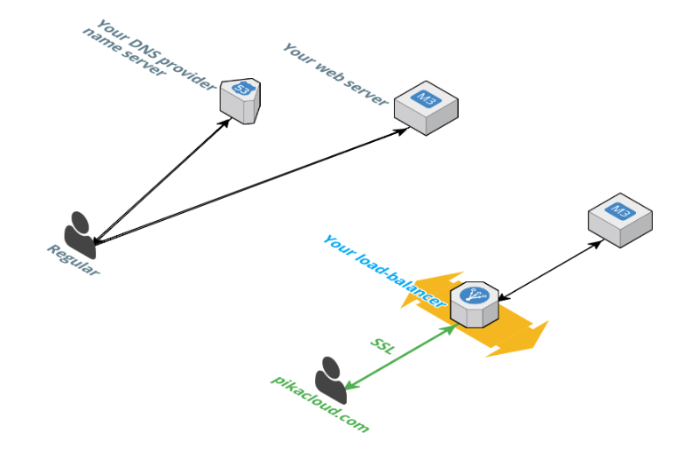

In order to use our SSL services, such as

  * One-click [Let's Encrypt](https://letsencrypt.org/) certificate deployment
  * Use your own certificate and manage your renewal alerting

you need to deploy a [Load Balancer](/lb/) on **PikaCloud** : it will redirect your legitimate trafic to your domain web server.

Then you can [deploy SSL](/ssl/) on your [Load Balancer].

