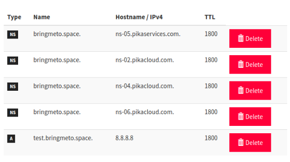

You are now **ready** to migrate your DNS hosting to the [PikaCloud](https://www.pikacloud.com/) infrastructure.

Here are the steps to follow for some domain name providers :

  * [OVH](/dns/migrate-ovh) based DNS migration

Here is the simple steps you would follow with any domain name reseller :

#### 1. Get a copy of your new `NS` entries on PikaCloud

On your domain name page, under the DNS section of PikaCloud, you find the NS records you need to provide



So as in your **Zone file** :
```
$TTL 1800
$ORIGIN bringmeto.space.
bringmeto.space.	1800	IN NS	ns-05.pikaservices.com.
bringmeto.space.	1800	IN NS	ns-02.pikacloud.com.
bringmeto.space.	1800	IN NS	ns-04.pikacloud.com.
bringmeto.space.	1800	IN NS	ns-06.pikacloud.com.
bringmeto.space.	IN SOA	ns-05.pikaservices.com. hostmaster.bringmeto.space. 2016091005 7200 900 1209600 86400
test.bringmeto.space.	1800	IN A	8.8.8.8
```

You need to take care of the `IN NS` entries. They are the one to provide to your domain name main NS entries for your migration.

#### 2. **Change** your `IN NS` entries with those given previously.

#### 3. **Apply** your DNS modifications.

#### 4. **Wait** for the DNS propagation time to render effective your modification.
